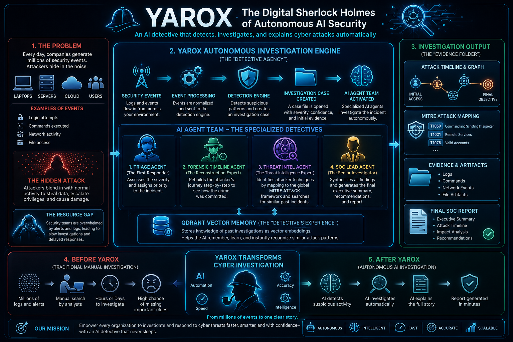
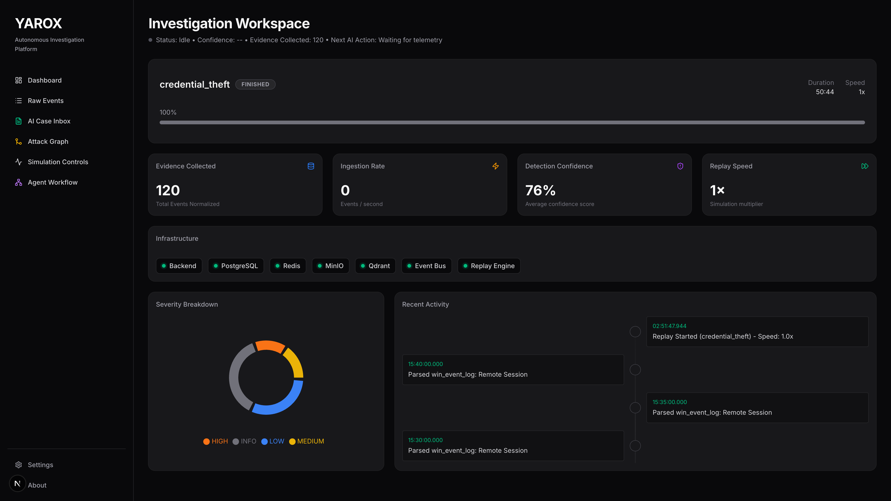
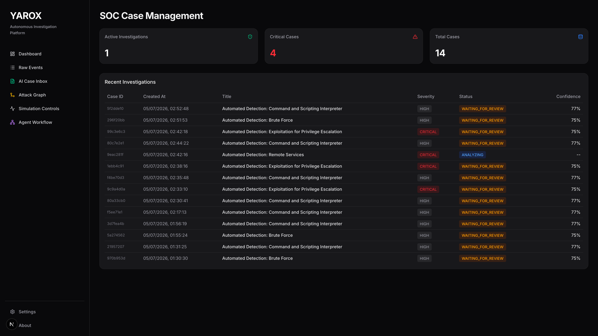
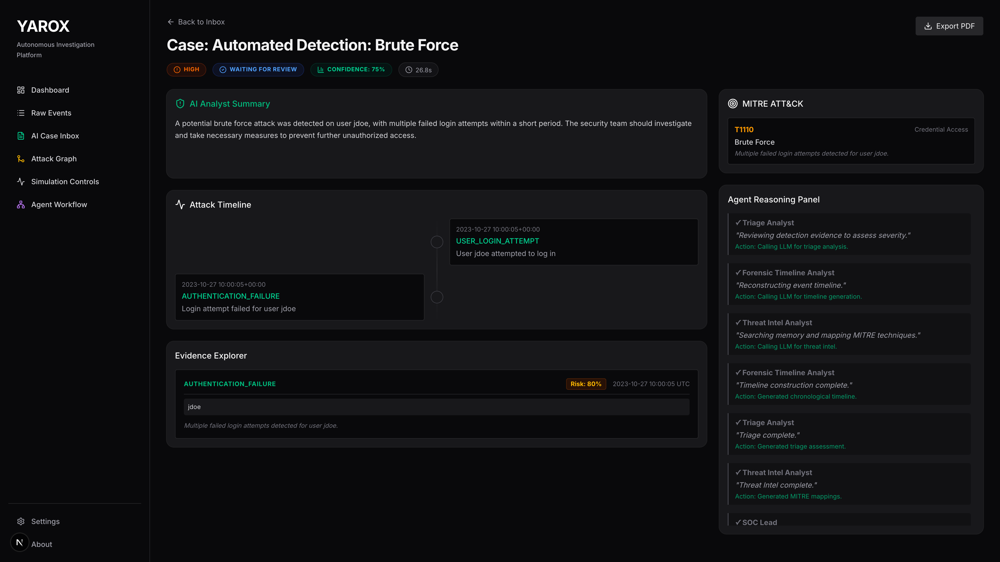
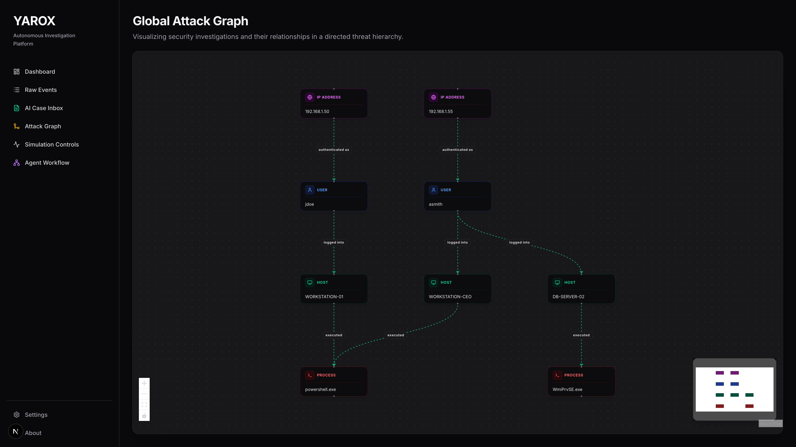

# 🕵️ YAROX
## Autonomous AI Security Investigation Platform

> Turning millions of security events into clear AI-powered investigations.

YAROX is an AI-driven cybersecurity investigation platform that acts like a team of digital security analysts.

Instead of only showing alerts, YAROX detects suspicious activity, investigates evidence, reconstructs attack timelines, maps attacker behavior, and generates complete investigation reports automatically.

Think of it as:

**Sherlock Holmes for computer systems.**

---

## 🚀 Demo Preview


---

# The Problem

Modern organizations generate millions of security events every day:

- User logins
- Application activity
- Network connections
- File access
- System commands

Hidden inside this noise could be an attacker.

Traditional workflow:

```text
Millions of Logs
        ↓
Security Alert
        ↓
Manual Investigation
        ↓
Hours of Analysis
        ↓
Final Report
```

Security teams spend significant time understanding:

- What happened?
- How did it happen?
- What evidence proves it?
- What should we do next?

---

# The YAROX Approach

```text
Security Events
      ↓
Detection Engine
      ↓
Investigation Created
      ↓
AI Agent Team Activated
      ↓
Evidence Analysis
      ↓
Attack Timeline
      ↓
MITRE ATT&CK Mapping
      ↓
SOC Report Generated
```

---

# Key Features

## Multi-Agent AI Investigation System

YAROX uses multiple specialized AI agents instead of one generic chatbot.

### Triage Agent

Determines:

- How serious is the incident?
- What is the priority?
- Immediate impact

### Timeline Agent

Reconstructs the attacker journey:

Example:

```text
Failed Login Attempts
        ↓
Account Compromise
        ↓
PowerShell Execution
        ↓
Data Access
```

### Threat Intelligence Agent

Maps attacker behavior to:

- MITRE ATT&CK techniques
- Known attack patterns
- Historical incidents

### SOC Lead Agent

Generates:

- Executive summary
- Evidence review
- Recommendations
- Final investigation report

---

# AI Agent Workflow

```text
                Agent Orchestrator
                        |
        --------------------------------
        |              |              |
   Triage Agent   Timeline Agent   Threat Intel
        |
        ↓
    SOC Report Agent
        |
        ↓
Final Investigation Report
```

---

# Intelligent Detection Engine

YAROX includes a modular detection framework.

Current detections:

✔ Brute Force Login Attempts  
✔ Suspicious PowerShell Execution  
✔ Privilege Escalation  
✔ Lateral Movement  

Example:

```text
Multiple failed logins
+
Hidden PowerShell command
+
Privilege change
=
High Risk Investigation Created
```

---

# AI Memory System

YAROX remembers previous investigations using vector search.

Powered by:

- Qdrant Vector Database
- Semantic Embeddings

Example:

New incident detected:
"Suspicious PowerShell activity"

YAROX:
"I found a similar previous investigation."

---

# Attack Visualization

Instead of reading thousands of logs:
YAROX creates attack graphs.

Example:

```text
User: John
      ↓ executed
Process:
PowerShell.exe
      ↓ running on
Machine:
WORKSTATION-01
      ↓ connected
External Server
```

---

# Screenshots

## Dashboard


## Investigation Center


## AI Agent Reasoning


## Attack Graph


---

# Architecture

```text
                    Frontend
                  (Next.js)
                       |
                       |
                    FastAPI
                       |
        --------------------------------
        |              |               |
   PostgreSQL       Redis           Qdrant
        |
        |
    Event Pipeline
        |
        |
 Detection Engine
        |
        |
AI Investigation Engine
```

---

# Technology Stack

## Frontend
- Next.js
- React
- Tailwind CSS
- Recharts
- XYFlow

## Backend
- Python
- FastAPI
- SQLAlchemy
- Celery
- Redis

## AI
- Ollama
- Local LLMs
- Multi-Agent Architecture
- RAG

## Databases
- PostgreSQL
- Qdrant Vector DB
- MinIO

## Infrastructure
- Docker
- Docker Compose

---

# Example Investigation

Attack:

```text
Attacker steals credentials
        ↓
Logs into system
        ↓
Executes malicious command
        ↓
Attempts data theft
```

YAROX Output:

```text
Incident: Credential Compromise
Severity: HIGH
Confidence: 92%
Evidence: 14 related events

MITRE:
T1110 Brute Force
T1059 Command Execution

Recommendation:
Disable account and investigate endpoint
```

---

# Project Architecture

```text
backend/
├── agents/
│   ├── triage.py
│   ├── timeline.py
│   ├── threat_intel.py
│   └── orchestrator.py
├── detection/
│   ├── engine.py
│   └── rules.py
├── services/
│   ├── llm_service.py
│   └── memory_service.py
├── models/
└── api/

frontend/
├── dashboard
├── investigations
└── attack-graph
```

---

# Future Roadmap

- Sigma rule engine
- Real EDR integrations
- Malware analysis agent
- Automated response actions
- Cloud security monitoring
- Advanced threat hunting

---

# Why I Built This

The goal was to explore:
- Autonomous AI agents
- Event-driven architectures
- AI reasoning workflows
- Vector memory systems
- Cybersecurity automation

YAROX demonstrates how AI can move beyond chat interfaces and become an active investigation system.

---

> Built with curiosity for the future of autonomous AI systems.
