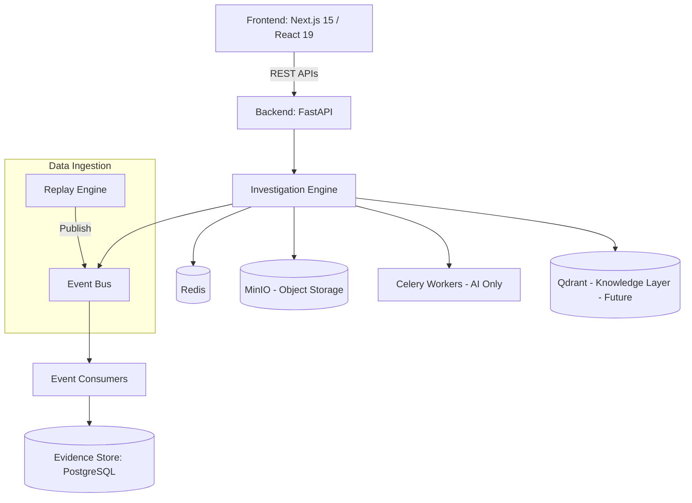
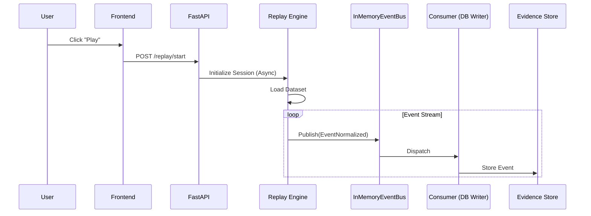
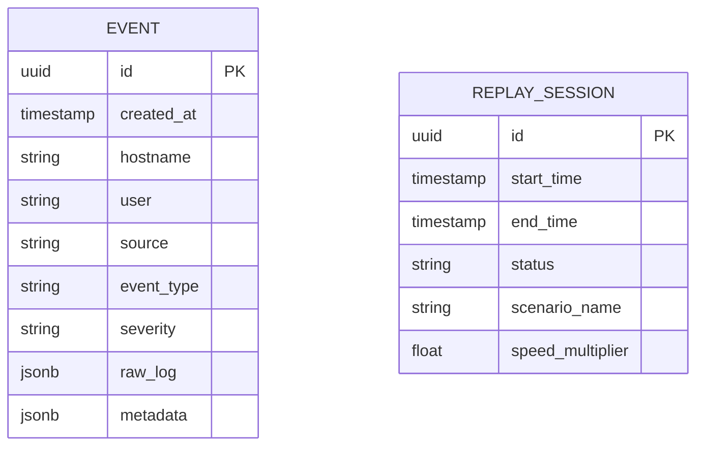
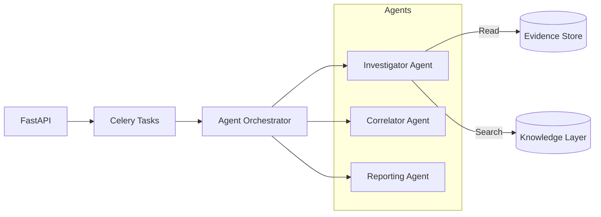

# YAROX Architecture: Investigation Engine

## 1. High-Level Architecture Diagram



## 2. Sequence Diagrams

### Replay Execution Flow


## 3. Database ER Diagram



## 4. API Flow

1.  **Health Check:** `GET /health` -> Validates DB, Redis, MinIO connectivity.
2.  **Replay Control:** `POST /replay/{action}` -> Updates session state in DB; signals background loop/task to stream data.
3.  **Event Ingestion:** Dataset `->` Replay Engine `->` `EventBus` `->` Consumers `->` Evidence Store.
4.  **Frontend Retrieval:** UI `->` `GET /events` `->` API queries DB with pagination/filters `->` JSON response.

## 5. Folder Structure Rationale

```text
YAROX/
├── backend/                  # Python/FastAPI code
│   ├── api/                  # FastAPI routers and endpoints
│   ├── core/                 # Shared configuration, event bus, security
│   ├── database/             # SQLAlchemy setup, Alembic migrations
│   ├── models/               # SQLAlchemy ORM models
│   ├── schemas/              # Pydantic validation schemas
│   ├── repositories/         # Database access layer (abstraction)
│   ├── services/             # Business logic layer
│   ├── plugins/              # Extensible Plugin Architecture
│   │   ├── parsers/          # e.g., generic.py, windows.py, linux.py
│   │   ├── providers/        # e.g., openai.py, anthropic.py
│   │   ├── tools/            
│   │   ├── agents/           
│   │   └── replay/           
│   ├── replay/               # Replay Engine logic
│   ├── consumers/            # Event Bus consumers (e.g., db_writer.py)
│   ├── workers/              # Celery tasks (AI workflows only)
│   └── tests/                # Pytest tests
```
**Rationale:** This structure enforces **Clean Architecture** and a highly extensible **Plugin Architecture**. By moving parsers, LLM providers, and agents into plugins, YAROX transitions from a single-purpose security application to a generalized Investigation Engine. Security becomes merely the first domain.

## 6. Event Bus Architecture

The current replay engine should NOT write directly to the database.
Instead, we use an Event Bus abstraction.

**IMPORTANT:**
Do NOT introduce Kafka, Redpanda, RabbitMQ, or NATS in this phase. The application is currently a single-node application. A distributed message broker would introduce unnecessary operational complexity without providing meaningful architectural benefits at this stage. Instead, implement an in-memory event bus.

Architecture:
Replay Engine `->` InMemoryEventBus `->` Event Consumers `->` Database `->` Frontend

The Event Bus must be interface-driven:
`EventBus (abstract interface) -> InMemoryEventBus (current implementation)`

Future implementations:
`KafkaEventBus`, `RedpandaEventBus`, `RabbitMQEventBus`

The application should never directly depend on a specific Event Bus implementation. Only depend on the EventBus interface. Every replay event should publish events through this interface.

Examples:
`ReplayStarted`, `ReplayPaused`, `ReplayResumed`, `ReplayCompleted`, `EventNormalized`, `EventStored`

Future AI agents should subscribe to these events without requiring architectural changes. This abstraction is mandatory because Phase 2 will eventually migrate to a distributed event bus if scaling requirements justify it.

For Phase 1.5, only the InMemoryEventBus is implemented. The architecture makes swapping implementations require minimal code changes.

## 7. Background Processing

Do NOT migrate replay execution to Celery.
The replay engine should remain an asynchronous in-process service.

Keep the Celery infrastructure scaffold because future AI investigations may require long-running asynchronous workflows.

However:
Replay execution, scheduling, and streaming must remain local asynchronous services.
Celery should not execute replay jobs during Phase 1.5.

## 8. Planned Agent Architecture (Future)


